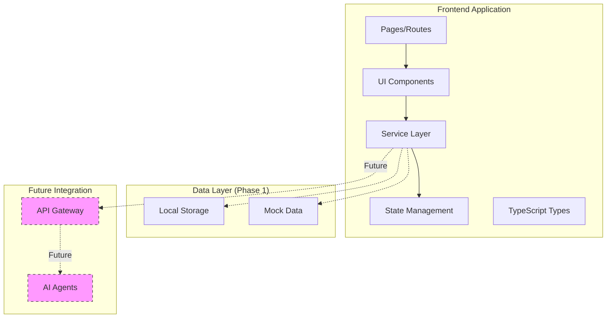

# Design Document

## Overview

The Day 1 Frontend MVP establishes HackaGallery's user-facing foundation using Next.js 15 with TypeScript, TailwindCSS for styling, and a service layer architecture that enables seamless transition from local state to API integration. The design prioritizes rapid development velocity while maintaining production-quality code structure, responsive design, and AWS Amplify deployment compatibility.

The application follows a modern React architecture with client-side state management, reusable component patterns, and a clear separation of concerns that will facilitate future backend integration without requiring significant refactoring.

## Architecture

### High-Level Architecture



### Technology Stack

**Framework**: Next.js 15.5.5 (App Router)
- Server and client components for optimal performance
- File-based routing for intuitive navigation
- Built-in optimization for images, fonts, and scripts
- Static site generation (SSG) for landing page
- Turbopack for faster builds

**Language**: TypeScript 5
- Type safety across the application
- Enhanced IDE support and autocomplete
- Reduced runtime errors
- Strict mode enabled

**Styling**: TailwindCSS 4
- Utility-first CSS for rapid UI development
- Consistent design system
- Responsive design utilities
- Dark mode support built-in
- Using @tailwindcss/postcss for Next.js integration

**React**: React 19.1.0
- Latest React features
- Improved performance
- Better TypeScript support

**State Management**: React Context + Hooks
- Lightweight solution for Phase 1
- Easy to migrate to Redux/Zustand if needed
- Sufficient for local state management

**Deployment**: AWS Amplify + CloudFront
- Automated CI/CD from Git repository
- Global CDN distribution
- SSL/HTTPS by default
- Environment variable management

### Directory Structure

The project already has a Next.js 15 setup with App Router. We'll extend the existing structure following the frontend standards:

```
frontend/
├── src/
│   ├── app/                      # Next.js App Router (existing)
│   │   ├── page.tsx             # Landing page (to be replaced)
│   │   ├── layout.tsx           # Root layout (existing, to be updated)
│   │   ├── globals.css          # Global styles (existing, to be extended)
│   │   ├── favicon.ico          # Favicon (existing)
│   │   ├── error.tsx            # Error boundary (new)
│   │   ├── loading.tsx          # Global loading state (new)
│   │   ├── events/              # New
│   │   │   ├── page.tsx         # Events listing
│   │   │   ├── loading.tsx      # Loading state
│   │   │   ├── [id]/
│   │   │   │   ├── page.tsx     # Event detail
│   │   │   │   └── loading.tsx  # Loading state
│   │   │   └── create/
│   │   │       └── page.tsx     # Create/edit event
│   │   └── projects/
│   │       ├── [id]/
│   │       │   ├── page.tsx     # Project detail
│   │       │   └── loading.tsx  # Loading state
│   │       └── submit/
│   │           └── page.tsx     # Submit/edit project
│   ├── components/
│   │   ├── ui/                  # Base UI components (following standards)
│   │   │   ├── Button.tsx
│   │   │   ├── Input.tsx
│   │   │   ├── Card.tsx
│   │   │   └── EmptyState.tsx
│   │   ├── features/            # Feature-specific components (following standards)
│   │   │   ├── EventCard.tsx
│   │   │   ├── EventForm.tsx
│   │   │   ├── EventDetail.tsx
│   │   │   ├── ProjectCard.tsx
│   │   │   ├── ProjectForm.tsx
│   │   │   └── ProjectDetail.tsx
│   │   ├── layout/              # Layout components (following standards)
│   │   │   ├── Header.tsx
│   │   │   ├── Footer.tsx
│   │   │   └── Navigation.tsx
│   │   └── landing/
│   │       ├── Hero.tsx
│   │       ├── Features.tsx
│   │       └── CallToAction.tsx
│   ├── lib/                     # Utilities and helpers (following standards)
│   │   ├── api/                 # API client functions
│   │   │   └── client.ts        # API client setup
│   │   ├── utils/               # Helper functions
│   │   │   ├── storage.ts       # Local storage utilities
│   │   │   └── validation.ts    # Form validation helpers
│   │   └── types/               # TypeScript types (following standards)
│   │       ├── event.ts         # Event type definitions
│   │       ├── project.ts       # Project type definitions
│   │       ├── user.ts          # User type definitions
│   │       └── service.ts       # Service interfaces
│   ├── hooks/                   # Custom React hooks (following standards)
│   │   ├── useLocalStorage.ts
│   │   └── useEvents.ts
│   └── services/                # Service layer (Phase 1: localStorage)
│       ├── eventService.ts      # Event CRUD operations
│       └── projectService.ts    # Project CRUD operations
├── public/
│   ├── images/
│   └── icons/
├── .env.local                    # Environment variables (not committed)
├── amplify.yml                   # Amplify build config
└── next.config.ts               # Next.js configuration
```

## Components and Interfaces

### Core Type Definitions

Following TypeScript strict mode and frontend standards:

```typescript
// lib/types/event.ts
export interface Event {
  id: string;
  name: string;
  description: string;
  startDate: string;
  endDate: string;
  location: string;
  prizes: Prize[];
  requirements: string;
  organizerId: string;
  organizerName: string;
  isHidden: boolean;
  createdAt: string;
  updatedAt: string;
}

export interface Prize {
  title: string;
  amount: string;
  description: string;
}

// lib/types/project.ts
export interface Project {
  id: string;
  eventId: string;
  name: string;
  description: string;
  githubUrl: string;
  demoUrl?: string;
  technologies: string[];
  teamMembers: TeamMember[];
  hackerId: string;
  isHidden: boolean;
  createdAt: string;
  updatedAt: string;
}

export interface TeamMember {
  name: string;
  role: string;
  githubUsername?: string;
}

// lib/types/user.ts
export interface User {
  id: string;
  name: string;
  email: string;
  role: 'hacker' | 'organizer' | 'investor';
  githubUsername?: string;
}

// lib/types/service.ts
export interface ServiceResponse<T> {
  data?: T;
  error?: string;
  success: boolean;
}

export interface ValidationResult {
  isValid: boolean;
  errors: Record<string, string>;
}
```


### Service Layer Interface

The service layer provides a consistent interface that abstracts data operations, enabling seamless transition from local storage to API calls. Following the frontend standards pattern for API integration.

```typescript
// lib/types/service.ts
import type { Event } from './event';
import type { Project } from './project';

export interface ServiceResponse<T> {
  data?: T;
  error?: string;
  success: boolean;
}

export interface IEventService {
  getAll(): Promise<ServiceResponse<Event[]>>;
  getById(id: string): Promise<ServiceResponse<Event>>;
  create(event: Omit<Event, 'id' | 'createdAt' | 'updatedAt'>): Promise<ServiceResponse<Event>>;
  update(id: string, event: Partial<Event>): Promise<ServiceResponse<Event>>;
  hide(id: string): Promise<ServiceResponse<void>>;
  getByOrganizer(organizerId: string): Promise<ServiceResponse<Event[]>>;
}

export interface IProjectService {
  getAll(): Promise<ServiceResponse<Project[]>>;
  getById(id: string): Promise<ServiceResponse<Project>>;
  getByEvent(eventId: string): Promise<ServiceResponse<Project[]>>;
  create(project: Omit<Project, 'id' | 'createdAt' | 'updatedAt'>): Promise<ServiceResponse<Project>>;
  update(id: string, project: Partial<Project>): Promise<ServiceResponse<Project>>;
  hide(id: string): Promise<ServiceResponse<void>>;
  getByHacker(hackerId: string): Promise<ServiceResponse<Project[]>>;
}
```

### Component Architecture

Following Next.js 15 App Router patterns with Server Components by default and Client Components only when needed.

#### Server vs Client Components Strategy

**Use Server Components for:**
- Data fetching from services
- Static content rendering
- SEO-optimized pages
- Large dependencies that should stay on server

**Use Client Components for:**
- Interactivity (onClick, onChange, etc.)
- Browser APIs (localStorage, window, etc.)
- React hooks (useState, useEffect, etc.)
- Event listeners

#### Page Components

**Landing Page** (`app/page.tsx`) - Server Component
```typescript
// Server Component (default, no 'use client')
export default function Home() {
  return (
    <div>
      <Hero />
      <Features />
      <CallToAction />
    </div>
  );
}
```
- Server component for optimal SEO
- Composed of Hero, Features, and CallToAction sections
- Static generation for fast loading

**Events Listing** (`app/events/page.tsx`) - Server Component with Client Children
```typescript
// Server Component for data fetching
import { eventService } from '@/services/eventService';

export default async function EventsPage() {
  const { data: events } = await eventService.getAll();
  return <EventsList events={events} />; // EventsList is client component
}
```
- Server component fetches data
- Client component (EventsList) handles interactivity
- Grid layout of EventCard components

**Event Detail** (`app/events/[id]/page.tsx`) - Server Component
```typescript
export default async function EventDetailPage({ params }: { params: { id: string } }) {
  const { data: event } = await eventService.getById(params.id);
  return <EventDetail event={event} />;
}
```
- Server component for data fetching
- Dynamic route with event ID
- Displays full event information

**Event Create/Edit** (`app/events/create/page.tsx`) - Client Component
```typescript
'use client';
// Client component for form state and interactivity
```
- Client component with form state
- Uses EventForm component
- Handles both create and edit modes via query params

**Project Detail** (`app/projects/[id]/page.tsx`) - Server Component
```typescript
export default async function ProjectDetailPage({ params }: { params: { id: string } }) {
  const { data: project } = await projectService.getById(params.id);
  return <ProjectDetail project={project} />;
}
```
- Server component for data fetching
- Dynamic route with project ID

**Project Submit/Edit** (`app/projects/submit/page.tsx`) - Client Component
```typescript
'use client';
// Client component for form state and interactivity
```
- Client component with form state
- Uses ProjectForm component

#### Reusable Components

Following the frontend standards component organization:

**Feature Components** (`components/features/`)

**EventCard** (Client Component)
```typescript
'use client';
import type { Event } from '@/lib/types/event';

interface EventCardProps {
  event: Event;
  onClick?: () => void;
}
```
- Displays event summary with image, title, dates, location
- Hover effects and responsive design
- Uses 'use client' directive for interactivity

**EventForm** (Client Component)
```typescript
'use client';
import type { Event } from '@/lib/types/event';

interface EventFormProps {
  initialData?: Event;
  onSubmit: (data: Omit<Event, 'id' | 'createdAt' | 'updatedAt'>) => void;
  onCancel: () => void;
}
```
- Controlled form with validation
- Dynamic prize fields (add/remove)
- Date pickers for start/end dates

**ProjectCard** (Client Component)
```typescript
'use client';
import type { Project } from '@/lib/types/project';

interface ProjectCardProps {
  project: Project;
  onClick?: () => void;
}
```
- Displays project summary with name, description, tech stack
- Technology badges
- Team member avatars

**ProjectForm** (Client Component)
```typescript
'use client';
import type { Project } from '@/lib/types/project';

interface ProjectFormProps {
  eventId: string;
  initialData?: Project;
  onSubmit: (data: Omit<Project, 'id' | 'createdAt' | 'updatedAt'>) => void;
  onCancel: () => void;
}
```
- Controlled form with validation
- Dynamic team member fields
- Technology tag input
- URL validation for GitHub and demo links

**UI Components** (`components/ui/`)
- Button: Variants (primary, secondary, outline), sizes, loading states
- Input: Text, textarea, date, URL with validation states
- Card: Container with consistent styling
- EmptyState: Placeholder for empty lists with call-to-action

## Data Models

### Storage Abstraction Layer

To ensure the solution is future-proof from day 1, we implement a storage adapter pattern that allows seamless migration from localStorage to AWS services.

**Storage Adapter Interface**
```typescript
// lib/types/storage.ts
export interface IStorageAdapter {
  get<T>(key: string): Promise<T | null>;
  set<T>(key: string, value: T): Promise<void>;
  remove(key: string): Promise<void>;
  clear(): Promise<void>;
  getAll<T>(prefix: string): Promise<T[]>;
}
```

**Phase 1: LocalStorage Adapter**
```typescript
// lib/adapters/localStorageAdapter.ts
import type { IStorageAdapter } from '@/lib/types/storage';

export class LocalStorageAdapter implements IStorageAdapter {
  async get<T>(key: string): Promise<T | null> {
    const item = localStorage.getItem(key);
    return item ? JSON.parse(item) : null;
  }

  async set<T>(key: string, value: T): Promise<void> {
    localStorage.setItem(key, JSON.stringify(value));
  }

  async remove(key: string): Promise<void> {
    localStorage.removeItem(key);
  }

  async clear(): Promise<void> {
    localStorage.clear();
  }

  async getAll<T>(prefix: string): Promise<T[]> {
    const items: T[] = [];
    for (let i = 0; i < localStorage.length; i++) {
      const key = localStorage.key(i);
      if (key?.startsWith(prefix)) {
        const item = await this.get<T>(key);
        if (item) items.push(item);
      }
    }
    return items;
  }
}
```

**Storage Factory**
```typescript
// lib/utils/storage.ts
import type { IStorageAdapter } from '@/lib/types/storage';
import { LocalStorageAdapter } from '@/lib/adapters/localStorageAdapter';

export function getStorageAdapter(): IStorageAdapter {
  // Phase 1: Return localStorage adapter
  return new LocalStorageAdapter();
  
  // Future Phase 2: Can switch based on environment
  // if (process.env.NEXT_PUBLIC_USE_API === 'true') {
  //   return new ApiStorageAdapter();
  // }
  // return new LocalStorageAdapter();
}

export const STORAGE_KEYS = {
  EVENTS: 'hackagallery_events',
  PROJECTS: 'hackagallery_projects',
  CURRENT_USER: 'hackagallery_user'
} as const;
```

**Future Phase 2: AWS Storage Adapter**
```typescript
// lib/adapters/awsStorageAdapter.ts (future implementation)
import type { IStorageAdapter } from '@/lib/types/storage';
import { apiClient } from '@/lib/api/client';

export class AwsStorageAdapter implements IStorageAdapter {
  async get<T>(key: string): Promise<T | null> {
    return await apiClient<T>(`/storage/${key}`);
  }

  async set<T>(key: string, value: T): Promise<void> {
    await apiClient(`/storage/${key}`, {
      method: 'PUT',
      body: JSON.stringify(value)
    });
  }

  async remove(key: string): Promise<void> {
    await apiClient(`/storage/${key}`, { method: 'DELETE' });
  }

  async clear(): Promise<void> {
    await apiClient('/storage', { method: 'DELETE' });
  }

  async getAll<T>(prefix: string): Promise<T[]> {
    return await apiClient<T[]>(`/storage?prefix=${prefix}`);
  }
}
```

This abstraction ensures that:
1. Services never directly access localStorage
2. Switching to AWS DynamoDB/S3 requires only changing the adapter
3. Component code remains completely unchanged
4. Testing is easier with mock adapters

### Mock Data

Initial mock data for development and demo purposes:

```typescript
// lib/utils/mockData.ts
import type { Event } from '@/lib/types/event';
import type { Project } from '@/lib/types/project';

export const mockEvents: Event[] = [
  {
    id: '1',
    name: 'AWS AI Agent Global Hackathon 2025',
    description: 'Build tomorrow\'s AI solution today...',
    startDate: '2025-10-15',
    endDate: '2025-10-21',
    location: 'Virtual',
    prizes: [
      { title: 'Grand Prize', amount: '$10,000', description: 'Best overall project' }
    ],
    requirements: 'Must use AWS AI services',
    organizerId: 'org1',
    organizerName: 'AWS',
    isHidden: false,
    createdAt: '2025-10-01T00:00:00Z',
    updatedAt: '2025-10-01T00:00:00Z'
  }
];

export const mockProjects: Project[] = [
  {
    id: '1',
    eventId: '1',
    name: 'HackaGallery',
    description: 'AI-powered hackathon project showcase platform',
    githubUrl: 'https://github.com/user/hackagallery',
    demoUrl: 'https://hackagallery.com',
    technologies: ['Next.js', 'TypeScript', 'AWS Bedrock', 'TailwindCSS'],
    teamMembers: [
      { name: 'John Doe', role: 'Full Stack Developer', githubUsername: 'johndoe' }
    ],
    hackerId: 'hacker1',
    isHidden: false,
    createdAt: '2025-10-15T00:00:00Z',
    updatedAt: '2025-10-15T00:00:00Z'
  }
];
```

## Error Handling

### Service Layer Error Handling

All service methods return a consistent `ServiceResponse` structure:

```typescript
// Success response
{
  success: true,
  data: <result>
}

// Error response
{
  success: false,
  error: "Error message"
}
```

### Form Validation

Client-side validation before submission:

```typescript
// lib/validation.ts
export const validateEvent = (event: Partial<Event>): ValidationResult => {
  const errors: Record<string, string> = {};
  
  if (!event.name?.trim()) errors.name = 'Event name is required';
  if (!event.description?.trim()) errors.description = 'Description is required';
  if (!event.startDate) errors.startDate = 'Start date is required';
  if (!event.endDate) errors.endDate = 'End date is required';
  if (event.startDate && event.endDate && event.startDate > event.endDate) {
    errors.endDate = 'End date must be after start date';
  }
  
  return {
    isValid: Object.keys(errors).length === 0,
    errors
  };
};

export const validateProject = (project: Partial<Project>): ValidationResult => {
  const errors: Record<string, string> = {};
  
  if (!project.name?.trim()) errors.name = 'Project name is required';
  if (!project.description?.trim()) errors.description = 'Description is required';
  if (!project.githubUrl?.trim()) errors.githubUrl = 'GitHub URL is required';
  if (project.githubUrl && !isValidUrl(project.githubUrl)) {
    errors.githubUrl = 'Invalid GitHub URL';
  }
  if (project.demoUrl && !isValidUrl(project.demoUrl)) {
    errors.demoUrl = 'Invalid demo URL';
  }
  
  return {
    isValid: Object.keys(errors).length === 0,
    errors
  };
};
```

### Error Boundaries and Loading States

Following Next.js 15 App Router patterns:

**Error Boundary** (`app/error.tsx`)
```typescript
'use client';

export default function Error({
  error,
  reset,
}: {
  error: Error & { digest?: string };
  reset: () => void;
}) {
  return (
    <div className="flex flex-col items-center justify-center min-h-screen">
      <h2 className="text-2xl font-bold mb-4">Something went wrong!</h2>
      <button onClick={reset} className="px-4 py-2 bg-blue-600 text-white rounded">
        Try again
      </button>
    </div>
  );
}
```

**Loading States** (`app/loading.tsx`, `app/events/loading.tsx`, etc.)
```typescript
export default function Loading() {
  return (
    <div className="grid grid-cols-1 md:grid-cols-2 lg:grid-cols-3 gap-6">
      {[...Array(6)].map((_, i) => (
        <div key={i} className="animate-pulse bg-gray-200 h-64 rounded-lg" />
      ))}
    </div>
  );
}
```

### User Feedback

- Success messages: Toast notifications (using react-hot-toast or similar)
- Error messages: Inline form errors + toast for system errors
- Loading states: Skeleton loaders and spinner buttons (using loading.tsx files)
- Empty states: Helpful messages with call-to-action

## Testing Strategy

### Phase 1 Testing Approach

Given the 6-day timeline, testing focuses on:

1. **Manual Testing**
   - Test all user flows end-to-end
   - Verify responsive design on multiple devices
   - Check form validation and error handling
   - Ensure data persistence in localStorage

2. **TypeScript Type Checking**
   - Compile-time type safety
   - Catch type errors before runtime

3. **ESLint + Prettier**
   - Code quality and consistency
   - Automated formatting

### Future Testing (Post-Hackathon)

Following frontend standards testing strategy:

- Unit tests: Vitest (not Jest)
- Component tests: React Testing Library
- E2E tests: Playwright
- Visual regression tests: Chromatic (optional)

## AWS Amplify Deployment

### Build Configuration

```yaml
# amplify.yml
version: 1
frontend:
  phases:
    preBuild:
      commands:
        - cd frontend
        - npm ci
    build:
      commands:
        - npm run build
  artifacts:
    baseDirectory: frontend/out
    files:
      - '**/*'
  cache:
    paths:
      - frontend/node_modules/**/*
      - frontend/.next/cache/**/*
```

Note: For static export to Amplify, we'll need to configure Next.js for static export by adding `output: 'export'` to next.config.ts.

### Environment Variables

Following frontend standards, create `.env.local` for local development:

```bash
# .env.local (not committed to git)
NEXT_PUBLIC_APP_URL=http://localhost:3000
NEXT_PUBLIC_API_URL=http://localhost:3001
NEXT_PUBLIC_AWS_REGION=us-east-1
NEXT_PUBLIC_S3_BUCKET=hackagallery-assets
```

For Amplify deployment:
```
# Amplify Console Environment Variables
NEXT_PUBLIC_APP_URL=https://hackagallery.amplifyapp.com
NEXT_PUBLIC_API_URL=<future-api-endpoint>
NEXT_PUBLIC_AWS_REGION=us-east-1
NEXT_PUBLIC_S3_BUCKET=hackagallery-assets-prod
NEXT_PUBLIC_ENV=production
```

### CloudFront Configuration

- Automatic HTTPS
- Global edge locations
- Caching strategy for static assets
- Custom domain support (future)

## Design System

### Color Palette

```css
/* Using existing CSS variables from globals.css */
:root {
  --background: #ffffff;
  --foreground: #171717;
}

@media (prefers-color-scheme: dark) {
  :root {
    --background: #0a0a0a;
    --foreground: #ededed;
  }
}

/* Additional colors to be added */
/* Primary Colors - AWS/Tech theme */
--primary-50: #eff6ff;
--primary-500: #3b82f6;
--primary-600: #2563eb;
--primary-700: #1d4ed8;

/* Neutral Colors */
--gray-50: #f9fafb;
--gray-100: #f3f4f6;
--gray-500: #6b7280;
--gray-900: #111827;

/* Semantic Colors */
--success: #10b981;
--error: #ef4444;
--warning: #f59e0b;
```

### Typography

```css
/* Font Family - Using Geist fonts from existing setup */
--font-geist-sans: var(--font-geist-sans);
--font-geist-mono: var(--font-geist-mono);

/* Font Sizes - Tailwind defaults */
--text-xs: 0.75rem;
--text-sm: 0.875rem;
--text-base: 1rem;
--text-lg: 1.125rem;
--text-xl: 1.25rem;
--text-2xl: 1.5rem;
--text-3xl: 1.875rem;
--text-4xl: 2.25rem;
```

### Spacing

Following Tailwind's 4px base unit system (0.25rem increments)

### Component Patterns

- Consistent border radius: 0.5rem (rounded-lg)
- Shadow elevation: subtle shadows for cards and modals
- Hover states: slight scale and shadow increase
- Focus states: ring outline for accessibility
- Transitions: 150ms ease-in-out for smooth interactions

## Performance Considerations

### Optimization Strategies

1. **Image Optimization**
   - Use Next.js `<Image>` component for all images (following frontend standards)
   - Specify width and height to prevent layout shift
   - Lazy loading for below-the-fold images
   - WebP format with fallbacks
   
   ```typescript
   import Image from 'next/image';
   
   <Image
     src={event.thumbnailUrl}
     alt={event.name}
     width={400}
     height={300}
     className="rounded-lg"
     priority={false}
   />
   ```

2. **Code Splitting**
   - Automatic route-based splitting
   - Dynamic imports for heavy components (following frontend standards)
   
   ```typescript
   import dynamic from 'next/dynamic';
   
   const ProjectAnalysis = dynamic(() => import('@/components/features/ProjectAnalysis'), {
     loading: () => <p>Loading analysis...</p>,
   });
   ```

3. **Static Generation**
   - Landing page as static HTML
   - Incremental Static Regeneration (ISR) for event/project pages (future)

4. **Bundle Size**
   - Tree shaking unused code
   - Minimize third-party dependencies
   - Use lightweight alternatives (e.g., date-fns over moment.js)

5. **Caching**
   - CloudFront edge caching
   - Browser caching for static assets
   - Service worker for offline support (future)

## Accessibility

- Semantic HTML elements
- ARIA labels where needed
- Keyboard navigation support
- Focus management for modals and forms
- Color contrast ratios meeting WCAG AA standards
- Alt text for images

## Migration Path to AWS Services

The storage adapter pattern ensures seamless migration from localStorage to AWS services with zero changes to component or service code.

**Phase 1: Service Using Storage Adapter**
```typescript
// services/eventService.ts
import type { IEventService, ServiceResponse } from '@/lib/types/service';
import type { Event } from '@/lib/types/event';
import { getStorageAdapter, STORAGE_KEYS } from '@/lib/utils/storage';

export const eventService: IEventService = {
  async getAll(): Promise<ServiceResponse<Event[]>> {
    try {
      const storage = getStorageAdapter();
      const events = await storage.get<Event[]>(STORAGE_KEYS.EVENTS) || [];
      return { success: true, data: events.filter(e => !e.isHidden) };
    } catch (error) {
      return { success: false, error: error.message };
    }
  },
  // ... other methods use storage adapter
};
```

**Phase 2: Migration to AWS (Only Change Storage Factory)**
```typescript
// lib/utils/storage.ts
import type { IStorageAdapter } from '@/lib/types/storage';
import { LocalStorageAdapter } from '@/lib/adapters/localStorageAdapter';
import { AwsStorageAdapter } from '@/lib/adapters/awsStorageAdapter';

export function getStorageAdapter(): IStorageAdapter {
  // Simply change this line to switch to AWS
  if (process.env.NEXT_PUBLIC_USE_AWS_STORAGE === 'true') {
    return new AwsStorageAdapter(); // Uses DynamoDB/S3 via API Gateway
  }
  return new LocalStorageAdapter();
}
```

**AWS Storage Adapter Implementation**
```typescript
// lib/adapters/awsStorageAdapter.ts
import type { IStorageAdapter } from '@/lib/types/storage';
import { apiClient } from '@/lib/api/client';

export class AwsStorageAdapter implements IStorageAdapter {
  async get<T>(key: string): Promise<T | null> {
    try {
      return await apiClient<T>(`/storage/${key}`);
    } catch {
      return null;
    }
  }

  async set<T>(key: string, value: T): Promise<void> {
    await apiClient(`/storage/${key}`, {
      method: 'PUT',
      body: JSON.stringify(value)
    });
  }

  async remove(key: string): Promise<void> {
    await apiClient(`/storage/${key}`, { method: 'DELETE' });
  }

  async clear(): Promise<void> {
    await apiClient('/storage', { method: 'DELETE' });
  }

  async getAll<T>(prefix: string): Promise<T[]> {
    return await apiClient<T[]>(`/storage?prefix=${prefix}`);
  }
}
```

**API Client (Following Frontend Standards)**
```typescript
// lib/api/client.ts
const API_BASE_URL = process.env.NEXT_PUBLIC_API_URL || 'http://localhost:3001';

export async function apiClient<T>(
  endpoint: string,
  options?: RequestInit
): Promise<T> {
  const response = await fetch(`${API_BASE_URL}${endpoint}`, {
    ...options,
    headers: {
      'Content-Type': 'application/json',
      ...options?.headers,
    },
  });

  if (!response.ok) {
    throw new Error(`API Error: ${response.statusText}`);
  }

  return response.json();
}
```

**Migration Benefits:**
- ✅ Zero changes to components
- ✅ Zero changes to service layer
- ✅ Only change: storage adapter implementation
- ✅ Can switch with environment variable
- ✅ Easy to test with mock adapters
- ✅ Future-proof from day 1

## Design Decisions and Rationales

1. **Next.js App Router over Pages Router**
   - Modern React patterns (Server Components)
   - Better performance with streaming
   - Simplified data fetching

2. **TailwindCSS over CSS-in-JS**
   - Faster development velocity
   - Smaller bundle size
   - Better performance (no runtime)

3. **Local Storage over Mock API**
   - Simpler Phase 1 implementation
   - No server setup required
   - Data persists across sessions
   - Easy to swap for real API

4. **Context API over Redux**
   - Sufficient for Phase 1 scope
   - Less boilerplate
   - Easier to learn and maintain
   - Can migrate to Redux if needed

5. **TypeScript Strict Mode**
   - Catch errors early
   - Better IDE support
   - Self-documenting code
   - Easier refactoring

This design provides a solid foundation for rapid development while maintaining code quality and enabling seamless future enhancements.
