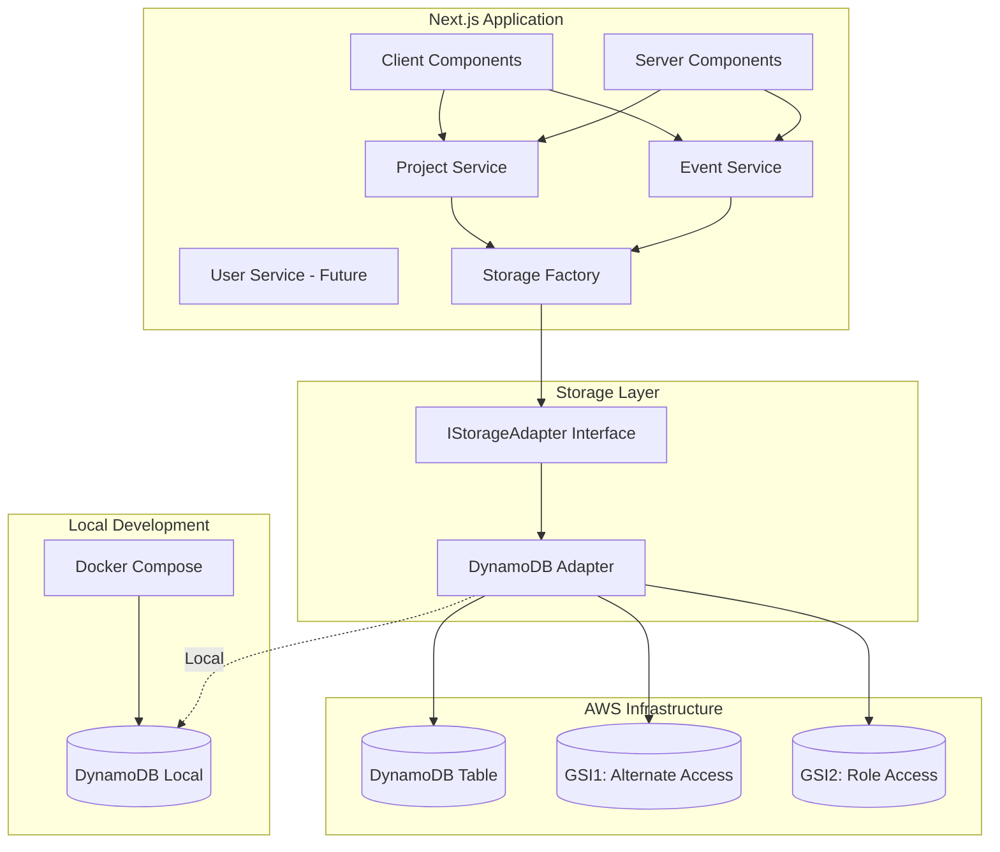

# Design Document: DynamoDB Migration

## Overview

This document outlines the technical design for migrating HackaGallery's storage solution from browser localStorage to Amazon DynamoDB. The migration will leverage the existing storage adapter abstraction pattern, enabling a seamless transition while restoring Server-Side Rendering (SSR) capabilities and providing a scalable, cloud-based storage solution.

### Goals

1. Replace localStorage with DynamoDB while maintaining existing service layer interfaces
2. Restore SSR capabilities for improved SEO and performance
3. Support multiple deployment platforms (AWS Amplify, Vercel, Netlify)
4. Enable local development with DynamoDB Local
5. Implement efficient query patterns using single-table design

### Non-Goals

1. Changing the existing service layer interfaces (IEventService, IProjectService)
2. Modifying the data models (Event, Project, User types)
3. Implementing real-time features or DynamoDB Streams
4. Adding authentication/authorization (future enhancement)

## Architecture

### High-Level Architecture




### Component Interaction Flow

1. **Server Components** (event/project listing and detail pages) call service methods during SSR
2. **Services** use the storage factory to get the appropriate adapter
3. **Storage Factory** returns DynamoDBAdapter (replacing LocalStorageAdapter)
4. **DynamoDBAdapter** translates generic storage operations into DynamoDB-specific queries
5. **DynamoDB** stores and retrieves data using optimized access patterns

## Components and Interfaces

### 1. DynamoDB Table Schema

#### Single Table Design

Following DynamoDB best practices, we'll use a single table with generic partition and sort keys to store all entities.

**Table Name**: `hackagallery-{environment}` (e.g., `hackagallery-dev`, `hackagallery-prod`)

**Primary Key**:
- Partition Key (PK): String
- Sort Key (SK): String

**Global Secondary Indexes**:
- GSI1: GSI1PK (partition key), GSI1SK (sort key)
- GSI2: GSI2PK (partition key), GSI2SK (sort key)

#### Entity Key Patterns

| Entity | PK | SK | GSI1PK | GSI1SK | GSI2PK | GSI2SK |
|--------|----|----|--------|--------|--------|--------|
| Event | EVENT#{eventId} | METADATA | ORGANIZER#{organizerId} | EVENT#{eventId} | - | - |
| Project | EVENT#{eventId} | PROJECT#{projectId} | HACKER#{hackerId} | PROJECT#{projectId} | - | - |
| User | USER#{userId} | METADATA | EMAIL#{email} | USER#{userId} | ROLE#{role} | USER#{userId} |


#### Access Patterns

| Access Pattern | Method | Index | Key Condition |
|----------------|--------|-------|---------------|
| Get event by ID | Query | Table | PK = EVENT#{eventId}, SK = METADATA |
| Get all events | Scan | Table | begins_with(PK, "EVENT#") |
| Get events by organizer | Query | GSI1 | GSI1PK = ORGANIZER#{organizerId} |
| Get project by ID | Query | Table | PK = EVENT#{eventId}, SK = PROJECT#{projectId} |
| Get projects by event | Query | Table | PK = EVENT#{eventId}, begins_with(SK, "PROJECT#") |
| Get projects by hacker | Query | GSI1 | GSI1PK = HACKER#{hackerId} |
| Get user by ID | Query | Table | PK = USER#{userId}, SK = METADATA |
| Get user by email | Query | GSI1 | GSI1PK = EMAIL#{email} |
| Get users by role | Query | GSI2 | GSI2PK = ROLE#{role} |

#### Sample Items

**Event Item**:
```json
{
  "PK": "EVENT#evt_123",
  "SK": "METADATA",
  "GSI1PK": "ORGANIZER#user_456",
  "GSI1SK": "EVENT#evt_123",
  "entityType": "Event",
  "id": "evt_123",
  "name": "HackMIT 2024",
  "description": "Annual hackathon at MIT",
  "startDate": "2024-09-15T09:00:00Z",
  "endDate": "2024-09-17T18:00:00Z",
  "location": "MIT Campus, Cambridge, MA",
  "prizes": [
    {
      "title": "First Place",
      "amount": "$10,000",
      "description": "Best overall project"
    }
  ],
  "requirements": "Must be a student",
  "organizerId": "user_456",
  "organizerName": "MIT Hacking Club",
  "isHidden": false,
  "createdAt": "2024-01-15T10:00:00Z",
  "updatedAt": "2024-01-15T10:00:00Z"
}
```


**Project Item**:
```json
{
  "PK": "EVENT#evt_123",
  "SK": "PROJECT#proj_789",
  "GSI1PK": "HACKER#user_101",
  "GSI1SK": "PROJECT#proj_789",
  "entityType": "Project",
  "id": "proj_789",
  "eventId": "evt_123",
  "name": "AI Study Buddy",
  "description": "An AI-powered study assistant",
  "githubUrl": "https://github.com/team/ai-study-buddy",
  "demoUrl": "https://ai-study-buddy.demo.com",
  "technologies": ["React", "Python", "OpenAI"],
  "teamMembers": [
    {
      "name": "Alice Johnson",
      "role": "Full Stack Developer",
      "githubUsername": "alicejohnson",
      "userId": "user_101"
    }
  ],
  "hackerId": "user_101",
  "isHidden": false,
  "createdAt": "2024-09-16T14:30:00Z",
  "updatedAt": "2024-09-16T14:30:00Z"
}
```

**User Item**:
```json
{
  "PK": "USER#user_101",
  "SK": "METADATA",
  "GSI1PK": "EMAIL#alice@example.com",
  "GSI1SK": "USER#user_101",
  "GSI2PK": "ROLE#hacker",
  "GSI2SK": "USER#user_101",
  "entityType": "User",
  "id": "user_101",
  "name": "Alice Johnson",
  "email": "alice@example.com",
  "role": "hacker",
  "githubUsername": "alicejohnson",
  "createdAt": "2024-01-10T08:00:00Z",
  "updatedAt": "2024-01-10T08:00:00Z"
}
```


### 2. DynamoDB Adapter Implementation

#### Class Structure

```typescript
// frontend/src/lib/adapters/dynamoDBAdapter.ts

import { DynamoDBClient } from '@aws-sdk/client-dynamodb';
import { 
  DynamoDBDocumentClient, 
  GetCommand, 
  PutCommand, 
  DeleteCommand, 
  QueryCommand,
  ScanCommand 
} from '@aws-sdk/lib-dynamodb';
import type { IStorageAdapter } from '@/lib/types/storage';

export class DynamoDBAdapter implements IStorageAdapter {
  private docClient: DynamoDBDocumentClient;
  private tableName: string;

  constructor(config?: {
    region?: string;
    endpoint?: string;
    tableName?: string;
  });

  async get<T>(key: string): Promise<T | null>;
  async set<T>(key: string, value: T): Promise<void>;
  async remove(key: string): Promise<void>;
  async clear(): Promise<void>;
  async getAll<T>(prefix: string): Promise<T[]>;
  
  // Helper methods
  private parseKey(key: string): { PK: string; SK: string };
  private buildKey(PK: string, SK: string): string;
  private addTimestamps<T>(item: T, isUpdate: boolean): T;
}
```


#### Key Translation Logic

The adapter translates localStorage-style keys into DynamoDB PK/SK patterns:

**Key Format**: `{entityType}:{id}` or `{entityType}:{parentId}:{childId}`

**Translation Examples**:
- `event:evt_123` → PK: `EVENT#evt_123`, SK: `METADATA`
- `project:evt_123:proj_789` → PK: `EVENT#evt_123`, SK: `PROJECT#proj_789`
- `user:user_101` → PK: `USER#user_101`, SK: `METADATA`

**Prefix Queries**:
- `event:` → Query all items where `begins_with(PK, "EVENT#")`
- `project:evt_123:` → Query where PK = `EVENT#evt_123` AND `begins_with(SK, "PROJECT#")`

#### Method Implementations

**get<T>(key: string): Promise<T | null>**
1. Parse key into PK and SK
2. Execute GetCommand with PK and SK
3. Return item or null if not found
4. Handle errors and log appropriately

**set<T>(key: string, value: T): Promise<void>**
1. Parse key into PK and SK
2. Add GSI keys based on entity type and attributes
3. Add/update timestamps (createdAt, updatedAt)
4. Execute PutCommand
5. Handle errors and retry with exponential backoff

**remove(key: string): Promise<void>**
1. Parse key into PK and SK
2. Execute DeleteCommand
3. Handle errors appropriately

**getAll<T>(prefix: string): Promise<T[]>**
1. Determine query strategy based on prefix
2. For entity-level prefix (e.g., "event:"): Use Scan with filter
3. For parent-child prefix (e.g., "project:evt_123:"): Use Query with PK
4. Implement pagination to handle large result sets
5. Return array of items


### 3. Configuration Management

#### Environment Variables

```typescript
// frontend/src/lib/config/aws.ts

export interface AWSConfig {
  region: string;
  tableName: string;
  endpoint?: string; // For local development
}

export function getAWSConfig(): AWSConfig {
  const region = process.env.AWS_REGION || process.env.NEXT_PUBLIC_AWS_REGION || 'us-east-1';
  const tableName = process.env.DYNAMODB_TABLE_NAME || process.env.NEXT_PUBLIC_DYNAMODB_TABLE_NAME;
  const endpoint = process.env.DYNAMODB_ENDPOINT || process.env.NEXT_PUBLIC_DYNAMODB_ENDPOINT;

  if (!tableName) {
    throw new Error('DYNAMODB_TABLE_NAME environment variable is required');
  }

  return {
    region,
    tableName,
    endpoint,
  };
}
```

#### Environment Variable Configuration by Platform

**Local Development (.env.local)**:
```env
DYNAMODB_ENDPOINT=http://localhost:8000
DYNAMODB_TABLE_NAME=hackagallery-local
AWS_REGION=us-east-1
AWS_ACCESS_KEY_ID=local
AWS_SECRET_ACCESS_KEY=local
```

**AWS Amplify**:
```env
DYNAMODB_TABLE_NAME=hackagallery-prod
AWS_REGION=us-east-1
# No credentials needed - uses IAM compute role
```

**Vercel/Netlify**:
```env
DYNAMODB_TABLE_NAME=hackagallery-prod
AWS_REGION=us-east-1
AWS_ACCESS_KEY_ID=<your-access-key>
AWS_SECRET_ACCESS_KEY=<your-secret-key>
```


### 4. Storage Factory Update

```typescript
// frontend/src/lib/utils/storage.ts

import type { IStorageAdapter } from '@/lib/types/storage';
import { LocalStorageAdapter } from '@/lib/adapters/localStorageAdapter';
import { DynamoDBAdapter } from '@/lib/adapters/dynamoDBAdapter';
import { getAWSConfig } from '@/lib/config/aws';

/**
 * Storage factory that returns the appropriate storage adapter
 * based on environment configuration.
 * 
 * Phase 1: Returns LocalStorageAdapter (browser-only)
 * Phase 2: Returns DynamoDBAdapter (works in SSR and client)
 */
export function getStorageAdapter(): IStorageAdapter {
  // Check if we're in a browser environment and should use localStorage
  // This is for backward compatibility during migration
  const useLocalStorage = process.env.NEXT_PUBLIC_USE_LOCALSTORAGE === 'true';
  
  if (useLocalStorage && typeof window !== 'undefined') {
    return new LocalStorageAdapter();
  }
  
  // Default to DynamoDB adapter
  const config = getAWSConfig();
  return new DynamoDBAdapter(config);
}
```

### 5. Service Layer Compatibility

No changes required to service layer! The existing services will continue to work:

- `eventService.ts` - Uses `getStorageAdapter()` internally
- `projectService.ts` - Uses `getStorageAdapter()` internally
- Future `userService.ts` - Will use the same pattern

The service methods remain unchanged:
- `getAll()`, `getById()`, `create()`, `update()`, `hide()`
- All return `ServiceResponse<T>` with success/error handling


## Data Models

### Entity Type Definitions

No changes to existing TypeScript interfaces:

- `Event` (from `lib/types/event.ts`) - Unchanged
- `Project` (from `lib/types/project.ts`) - Unchanged
- `User` (from `lib/types/user.ts`) - Unchanged

### DynamoDB Attribute Mapping

All TypeScript properties map directly to DynamoDB attributes. Complex types (arrays, nested objects) are stored as native DynamoDB types:

- `string` → String (S)
- `number` → Number (N)
- `boolean` → Boolean (BOOL)
- `string[]` → List (L) of Strings
- `object` → Map (M)
- `object[]` → List (L) of Maps

Example: `prizes: Prize[]` is stored as a List of Maps in DynamoDB.

## Error Handling

### Error Categories

1. **Configuration Errors**: Missing environment variables, invalid configuration
2. **Connection Errors**: Cannot connect to DynamoDB (network issues, wrong endpoint)
3. **Authentication Errors**: Invalid credentials, insufficient permissions
4. **Throttling Errors**: Rate limit exceeded
5. **Item Not Found**: Requested item doesn't exist
6. **Validation Errors**: Invalid data format

### Error Handling Strategy

```typescript
// Retry logic with exponential backoff
async function executeWithRetry<T>(
  operation: () => Promise<T>,
  maxRetries: number = 3
): Promise<T> {
  let lastError: Error;
  
  for (let attempt = 0; attempt < maxRetries; attempt++) {
    try {
      return await operation();
    } catch (error) {
      lastError = error as Error;
      
      // Don't retry on certain errors
      if (isNonRetryableError(error)) {
        throw error;
      }
      
      // Exponential backoff: 100ms, 200ms, 400ms
      const delay = 100 * Math.pow(2, attempt);
      await new Promise(resolve => setTimeout(resolve, delay));
    }
  }
  
  throw lastError!;
}
```


### Service Response Pattern

Services already return `ServiceResponse<T>`:

```typescript
interface ServiceResponse<T> {
  success: boolean;
  data?: T;
  error?: string;
}
```

The adapter will catch errors and allow services to return appropriate responses:

```typescript
// In eventService.ts
async getAll(): Promise<ServiceResponse<Event[]>> {
  try {
    const events = await this.storage.getAll<Event>('event:');
    return { success: true, data: events };
  } catch (error) {
    console.error('Error fetching events:', error);
    return { 
      success: false, 
      error: 'Failed to fetch events. Please try again later.' 
    };
  }
}
```

## Testing Strategy

### Unit Tests

**DynamoDB Adapter Tests** (`dynamoDBAdapter.test.ts`):
- Test key parsing and translation
- Test CRUD operations with mocked DynamoDB client
- Test error handling and retries
- Test timestamp management
- Test GSI key generation

**Storage Factory Tests** (`storage.test.ts`):
- Test adapter selection based on environment
- Test configuration validation

### Integration Tests

**DynamoDB Integration Tests** (`dynamoDBAdapter.integration.test.ts`):
- Use DynamoDB Local via Testcontainers or Docker
- Test actual CRUD operations
- Test query patterns and GSI queries
- Test pagination
- Test concurrent operations

**Service Integration Tests**:
- Test eventService with DynamoDB adapter
- Test projectService with DynamoDB adapter
- Verify data consistency


### Test Environment Setup

**Docker Compose for DynamoDB Local**:

```yaml
# docker-compose.yml
version: '3.8'
services:
  dynamodb-local:
    image: amazon/dynamodb-local:latest
    container_name: hackagallery-dynamodb-local
    ports:
      - "8000:8000"
    command: "-jar DynamoDBLocal.jar -sharedDb -inMemory"
```

**Test Configuration**:

```typescript
// jest.config.js or vitest.config.ts
export default {
  testEnvironment: 'node',
  setupFilesAfterEnv: ['<rootDir>/tests/setup.ts'],
  testMatch: ['**/*.test.ts'],
  collectCoverageFrom: [
    'src/lib/adapters/dynamoDBAdapter.ts',
    'src/lib/utils/storage.ts',
  ],
  coverageThreshold: {
    global: {
      branches: 80,
      functions: 80,
      lines: 80,
      statements: 80,
    },
  },
};
```

## Infrastructure as Code

### CloudFormation Template

```yaml
# infrastructure/dynamodb-table.yaml
AWSTemplateFormatVersion: '2010-09-09'
Description: 'DynamoDB table for HackaGallery application'

Parameters:
  Environment:
    Type: String
    Default: dev
    AllowedValues:
      - dev
      - staging
      - prod
    Description: Environment name

Resources:
  HackaGalleryTable:
    Type: AWS::DynamoDB::Table
    Properties:
      TableName: !Sub 'hackagallery-${Environment}'
      BillingMode: PAY_PER_REQUEST
      PointInTimeRecoverySpecification:
        PointInTimeRecoveryEnabled: true
      AttributeDefinitions:
        - AttributeName: PK
          AttributeType: S
        - AttributeName: SK
          AttributeType: S
        - AttributeName: GSI1PK
          AttributeType: S
        - AttributeName: GSI1SK
          AttributeType: S
        - AttributeName: GSI2PK
          AttributeType: S
        - AttributeName: GSI2SK
          AttributeType: S
      KeySchema:
        - AttributeName: PK
          KeyType: HASH
        - AttributeName: SK
          KeyType: RANGE
      GlobalSecondaryIndexes:
        - IndexName: GSI1
          KeySchema:
            - AttributeName: GSI1PK
              KeyType: HASH
            - AttributeName: GSI1SK
              KeyType: RANGE
          Projection:
            ProjectionType: ALL
        - IndexName: GSI2
          KeySchema:
            - AttributeName: GSI2PK
              KeyType: HASH
            - AttributeName: GSI2SK
              KeyType: RANGE
          Projection:
            ProjectionType: ALL
      Tags:
        - Key: Application
          Value: HackaGallery
        - Key: Environment
          Value: !Ref Environment

Outputs:
  TableName:
    Description: Name of the DynamoDB table
    Value: !Ref HackaGalleryTable
    Export:
      Name: !Sub '${AWS::StackName}-TableName'
  
  TableArn:
    Description: ARN of the DynamoDB table
    Value: !GetAtt HackaGalleryTable.Arn
    Export:
      Name: !Sub '${AWS::StackName}-TableArn'
```


### IAM Policies

**Application IAM Policy** (for Amplify compute role or IAM user):

```json
{
  "Version": "2012-10-17",
  "Statement": [
    {
      "Sid": "DynamoDBTableAccess",
      "Effect": "Allow",
      "Action": [
        "dynamodb:GetItem",
        "dynamodb:PutItem",
        "dynamodb:UpdateItem",
        "dynamodb:DeleteItem",
        "dynamodb:Query",
        "dynamodb:Scan",
        "dynamodb:BatchGetItem",
        "dynamodb:BatchWriteItem"
      ],
      "Resource": [
        "arn:aws:dynamodb:*:*:table/hackagallery-*",
        "arn:aws:dynamodb:*:*:table/hackagallery-*/index/*"
      ]
    }
  ]
}
```

### AWS CDK Alternative (TypeScript)

```typescript
// infrastructure/lib/dynamodb-stack.ts
import * as cdk from 'aws-cdk-lib';
import * as dynamodb from 'aws-cdk-lib/aws-dynamodb';
import { Construct } from 'constructs';

export class DynamoDBStack extends cdk.Stack {
  public readonly table: dynamodb.Table;

  constructor(scope: Construct, id: string, props?: cdk.StackProps) {
    super(scope, id, props);

    const environment = process.env.ENVIRONMENT || 'dev';

    this.table = new dynamodb.Table(this, 'HackaGalleryTable', {
      tableName: `hackagallery-${environment}`,
      partitionKey: { name: 'PK', type: dynamodb.AttributeType.STRING },
      sortKey: { name: 'SK', type: dynamodb.AttributeType.STRING },
      billingMode: dynamodb.BillingMode.PAY_PER_REQUEST,
      pointInTimeRecovery: true,
      removalPolicy: cdk.RemovalPolicy.RETAIN,
    });

    // GSI1: Alternate access patterns
    this.table.addGlobalSecondaryIndex({
      indexName: 'GSI1',
      partitionKey: { name: 'GSI1PK', type: dynamodb.AttributeType.STRING },
      sortKey: { name: 'GSI1SK', type: dynamodb.AttributeType.STRING },
      projectionType: dynamodb.ProjectionType.ALL,
    });

    // GSI2: Role-based access
    this.table.addGlobalSecondaryIndex({
      indexName: 'GSI2',
      partitionKey: { name: 'GSI2PK', type: dynamodb.AttributeType.STRING },
      sortKey: { name: 'GSI2SK', type: dynamodb.AttributeType.STRING },
      projectionType: dynamodb.ProjectionType.ALL,
    });

    new cdk.CfnOutput(this, 'TableName', {
      value: this.table.tableName,
      exportName: `${id}-TableName`,
    });

    new cdk.CfnOutput(this, 'TableArn', {
      value: this.table.tableArn,
      exportName: `${id}-TableArn`,
    });
  }
}
```


## Deployment Configuration

### Next.js Configuration Changes

**Remove Static Export** (`next.config.ts`):

```typescript
// BEFORE (Phase 1 with localStorage)
const nextConfig: NextConfig = {
  output: 'export', // Static export for localStorage
  images: {
    unoptimized: true,
  },
};

// AFTER (Phase 2 with DynamoDB)
const nextConfig: NextConfig = {
  // Remove output: 'export' to enable SSR
  images: {
    // Can now use optimized images with SSR
    remotePatterns: [
      {
        protocol: 'https',
        hostname: '**.amazonaws.com',
      },
    ],
  },
};
```

### Platform-Specific Deployment

#### AWS Amplify

**amplify.yml**:

```yaml
version: 1
frontend:
  phases:
    preBuild:
      commands:
        - npm ci
    build:
      commands:
        - npm run build
  artifacts:
    baseDirectory: .next
    files:
      - '**/*'
  cache:
    paths:
      - node_modules/**/*
      - .next/cache/**/*
```

**Environment Variables** (set in Amplify Console):
- `DYNAMODB_TABLE_NAME`: hackagallery-prod
- `AWS_REGION`: us-east-1

**IAM Compute Role**: Attach the DynamoDB access policy to the Amplify app's compute role.


#### Vercel

**vercel.json** (optional):

```json
{
  "buildCommand": "npm run build",
  "devCommand": "npm run dev",
  "installCommand": "npm ci",
  "framework": "nextjs"
}
```

**Environment Variables** (set in Vercel Dashboard):
- `DYNAMODB_TABLE_NAME`: hackagallery-prod
- `AWS_REGION`: us-east-1
- `AWS_ACCESS_KEY_ID`: <your-access-key>
- `AWS_SECRET_ACCESS_KEY`: <your-secret-key>

#### Netlify

**netlify.toml**:

```toml
[build]
  command = "npm run build"
  publish = ".next"

[build.environment]
  NODE_VERSION = "20"

[[plugins]]
  package = "@netlify/plugin-nextjs"
```

**Environment Variables** (set in Netlify Dashboard):
- `DYNAMODB_TABLE_NAME`: hackagallery-prod
- `AWS_REGION`: us-east-1
- `AWS_ACCESS_KEY_ID`: <your-access-key>
- `AWS_SECRET_ACCESS_KEY`: <your-secret-key>

## Migration Strategy

### Phase 1: Preparation (Current State)
- Application uses localStorage
- Pages are Client Components with "use client"
- Static export enabled

### Phase 2: DynamoDB Setup
1. Create DynamoDB table using CloudFormation/CDK
2. Set up DynamoDB Local for development
3. Configure environment variables

### Phase 3: Adapter Implementation
1. Implement DynamoDBAdapter
2. Update storage factory
3. Add configuration management
4. Write unit tests

### Phase 4: Integration Testing
1. Test with DynamoDB Local
2. Verify all CRUD operations
3. Test query patterns
4. Validate error handling

### Phase 5: Next.js Configuration
1. Remove static export configuration
2. Convert listing/detail pages to Server Components
3. Test SSR functionality locally

### Phase 6: Deployment
1. Deploy infrastructure (DynamoDB table)
2. Configure IAM roles/policies
3. Deploy application to chosen platform
4. Verify production functionality

### Phase 7: Data Migration (if needed)
1. Export data from localStorage (if any production data exists)
2. Transform data to DynamoDB format
3. Import data using batch write operations
4. Verify data integrity


## Local Development Setup

### Prerequisites

- Docker and Docker Compose installed
- Node.js 20+ installed
- AWS CLI configured (optional, for testing with real AWS)

### Setup Steps

1. **Start DynamoDB Local**:
```bash
docker-compose up -d dynamodb-local
```

2. **Create Local Table**:
```bash
npm run setup:dynamodb-local
```

This script will:
- Check if DynamoDB Local is running
- Create the table with proper schema
- Create GSI1 and GSI2 indexes
- Optionally seed with sample data

3. **Configure Environment**:
```bash
cp .env.local.example .env.local
# Edit .env.local with local settings
```

4. **Run Application**:
```bash
npm run dev
```

### Development Scripts

**package.json additions**:

```json
{
  "scripts": {
    "dev": "next dev",
    "build": "next build",
    "start": "next start",
    "setup:dynamodb-local": "node scripts/setup-dynamodb-local.js",
    "seed:local": "node scripts/seed-local-data.js",
    "test": "jest",
    "test:integration": "jest --testMatch='**/*.integration.test.ts'"
  }
}
```

### Setup Script

```javascript
// scripts/setup-dynamodb-local.js
const { DynamoDBClient } = require('@aws-sdk/client-dynamodb');
const { 
  CreateTableCommand, 
  DescribeTableCommand 
} = require('@aws-sdk/client-dynamodb');

const client = new DynamoDBClient({
  region: 'us-east-1',
  endpoint: 'http://localhost:8000',
  credentials: {
    accessKeyId: 'local',
    secretAccessKey: 'local',
  },
});

async function setupTable() {
  const tableName = 'hackagallery-local';
  
  try {
    // Check if table exists
    await client.send(new DescribeTableCommand({ TableName: tableName }));
    console.log(`Table ${tableName} already exists`);
    return;
  } catch (error) {
    // Table doesn't exist, create it
  }
  
  const createTableCommand = new CreateTableCommand({
    TableName: tableName,
    BillingMode: 'PAY_PER_REQUEST',
    AttributeDefinitions: [
      { AttributeName: 'PK', AttributeType: 'S' },
      { AttributeName: 'SK', AttributeType: 'S' },
      { AttributeName: 'GSI1PK', AttributeType: 'S' },
      { AttributeName: 'GSI1SK', AttributeType: 'S' },
      { AttributeName: 'GSI2PK', AttributeType: 'S' },
      { AttributeName: 'GSI2SK', AttributeType: 'S' },
    ],
    KeySchema: [
      { AttributeName: 'PK', KeyType: 'HASH' },
      { AttributeName: 'SK', KeyType: 'RANGE' },
    ],
    GlobalSecondaryIndexes: [
      {
        IndexName: 'GSI1',
        KeySchema: [
          { AttributeName: 'GSI1PK', KeyType: 'HASH' },
          { AttributeName: 'GSI1SK', KeyType: 'RANGE' },
        ],
        Projection: { ProjectionType: 'ALL' },
      },
      {
        IndexName: 'GSI2',
        KeySchema: [
          { AttributeName: 'GSI2PK', KeyType: 'HASH' },
          { AttributeName: 'GSI2SK', KeyType: 'RANGE' },
        ],
        Projection: { ProjectionType: 'ALL' },
      },
    ],
  });
  
  await client.send(createTableCommand);
  console.log(`Table ${tableName} created successfully`);
}

setupTable().catch(console.error);
```


## Performance Considerations

### Query Optimization

1. **Use Query over Scan**: All access patterns use Query operations with specific PK/SK values
2. **Leverage GSIs**: Alternate access patterns (by organizer, by hacker, by email, by role) use GSIs
3. **Pagination**: Implement pagination for large result sets using `LastEvaluatedKey`
4. **Projection Expressions**: Only fetch required attributes when possible (future optimization)

### Connection Pooling

```typescript
// Singleton pattern for DynamoDB client
let dynamoDBClient: DynamoDBClient | null = null;
let docClient: DynamoDBDocumentClient | null = null;

export function getDynamoDBClient(config: AWSConfig): DynamoDBClient {
  if (!dynamoDBClient) {
    dynamoDBClient = new DynamoDBClient({
      region: config.region,
      endpoint: config.endpoint,
      maxAttempts: 3,
    });
  }
  return dynamoDBClient;
}

export function getDocumentClient(config: AWSConfig): DynamoDBDocumentClient {
  if (!docClient) {
    const client = getDynamoDBClient(config);
    docClient = DynamoDBDocumentClient.from(client, {
      marshallOptions: {
        removeUndefinedValues: true,
        convertClassInstanceToMap: true,
      },
    });
  }
  return docClient;
}
```

### Caching Strategy (Future Enhancement)

Consider implementing caching for frequently accessed data:
- Use Next.js built-in caching with `revalidate` option
- Implement Redis/ElastiCache for session-level caching
- Use DynamoDB DAX for microsecond latency (if needed)

## Security Considerations

### Data Protection

1. **Encryption at Rest**: DynamoDB encrypts all data at rest by default
2. **Encryption in Transit**: All API calls use HTTPS/TLS
3. **Point-in-Time Recovery**: Enabled for production tables

### Access Control

1. **Principle of Least Privilege**: IAM policies grant only necessary permissions
2. **No Hardcoded Credentials**: Use IAM roles (Amplify) or environment variables (Vercel/Netlify)
3. **Environment Separation**: Separate tables for dev/staging/prod

### Input Validation

Existing validation utilities remain in place:
- `validateEvent()` and `validateProject()` functions
- Service layer validates data before storage
- TypeScript provides compile-time type safety


## Monitoring and Observability

### CloudWatch Metrics

Monitor the following DynamoDB metrics:
- `ConsumedReadCapacityUnits` / `ConsumedWriteCapacityUnits`
- `UserErrors` (4xx errors)
- `SystemErrors` (5xx errors)
- `ThrottledRequests`
- `SuccessfulRequestLatency`

### Application Logging

```typescript
// Enhanced logging in DynamoDBAdapter
private log(level: 'info' | 'warn' | 'error', message: string, meta?: any) {
  const logEntry = {
    timestamp: new Date().toISOString(),
    level,
    message,
    adapter: 'DynamoDBAdapter',
    ...meta,
  };
  
  if (level === 'error') {
    console.error(JSON.stringify(logEntry));
  } else if (level === 'warn') {
    console.warn(JSON.stringify(logEntry));
  } else {
    console.log(JSON.stringify(logEntry));
  }
}
```

### Health Check Endpoint

```typescript
// app/api/health/route.ts
import { NextResponse } from 'next/server';
import { getStorageAdapter } from '@/lib/utils/storage';

export async function GET() {
  try {
    const adapter = getStorageAdapter();
    
    // Simple health check: try to query the table
    await adapter.getAll('event:');
    
    return NextResponse.json({
      status: 'healthy',
      timestamp: new Date().toISOString(),
      storage: 'dynamodb',
    });
  } catch (error) {
    return NextResponse.json(
      {
        status: 'unhealthy',
        timestamp: new Date().toISOString(),
        storage: 'dynamodb',
        error: error instanceof Error ? error.message : 'Unknown error',
      },
      { status: 503 }
    );
  }
}
```

## Rollback Strategy

### Rollback Plan

If issues arise after deployment:

1. **Immediate Rollback**: Revert to previous deployment (static export with localStorage)
2. **Environment Variable Toggle**: Set `NEXT_PUBLIC_USE_LOCALSTORAGE=true` to fall back to localStorage
3. **Data Preservation**: DynamoDB data remains intact for future retry

### Gradual Migration

Consider a gradual migration approach:
1. Deploy DynamoDB adapter alongside localStorage
2. Write to both storage backends (dual-write)
3. Read from DynamoDB, fall back to localStorage on error
4. Monitor for issues
5. Remove localStorage after confidence is established

## Schema Evolution and Extensibility

### Adding New Fields

DynamoDB is schema-less, making it easy to add new fields without migrations:

**Example: Adding "approvalStatus" to Projects**

1. **Update TypeScript Interface**:
```typescript
// lib/types/project.ts
export interface Project {
  id: string;
  eventId: string;
  name: string;
  // ... existing fields ...
  approvalStatus?: 'pending' | 'approved' | 'rejected'; // New field
  approvedBy?: string; // New field: organizerId who approved
  approvedAt?: string; // New field: timestamp
}
```

2. **No Database Migration Needed**: Simply start writing the new fields
```typescript
// When creating/updating a project
const project: Project = {
  // ... existing fields ...
  approvalStatus: 'pending', // New field automatically stored
};
```

3. **Backward Compatibility**: Existing items without the new field work fine
```typescript
// Old items: { id: 'proj_1', name: 'Old Project', ... }
// New items: { id: 'proj_2', name: 'New Project', approvalStatus: 'pending', ... }
// Both work seamlessly!
```

### Adding New Access Patterns

**Example: Query projects by approval status**

1. **Option A: Use existing GSI with sparse index**
```typescript
// When writing project with approval status
{
  PK: "EVENT#evt_123",
  SK: "PROJECT#proj_789",
  GSI1PK: "HACKER#user_101",
  GSI1SK: "PROJECT#proj_789",
  GSI2PK: "APPROVAL#pending", // New! Only set when status exists
  GSI2SK: "PROJECT#proj_789",
  approvalStatus: "pending"
}

// Query all pending projects across all events
Query GSI2 where GSI2PK = "APPROVAL#pending"
```

2. **Option B: Add new GSI if needed**
- Update CloudFormation/CDK template
- Add GSI3 with new key pattern
- No data migration required - GSI builds automatically

### Schema Versioning Strategy

For major schema changes, use a version field:

```typescript
{
  PK: "EVENT#evt_123",
  SK: "METADATA",
  schemaVersion: "2.0", // Track schema version
  // ... fields based on version ...
}
```

Application code can handle different versions:
```typescript
function parseEvent(item: any): Event {
  const version = item.schemaVersion || "1.0";
  
  if (version === "1.0") {
    // Handle old schema
    return transformV1ToV2(item);
  }
  
  // Handle current schema
  return item as Event;
}
```

### Best Practices for Schema Evolution

1. **Always Add, Never Remove**: Add new optional fields instead of removing old ones
2. **Use Optional Fields**: Make new fields optional (`?`) in TypeScript
3. **Default Values**: Provide sensible defaults when reading old items
4. **Gradual Migration**: Update items lazily as they're accessed
5. **Sparse Indexes**: Only populate GSI keys when the field exists (saves storage)

## Future Enhancements

### Potential Improvements

1. **DynamoDB Streams**: Enable real-time notifications for data changes
2. **Global Tables**: Multi-region replication for global availability
3. **DAX**: Add DynamoDB Accelerator for microsecond latency
4. **Batch Operations**: Optimize bulk writes with BatchWriteItem
5. **Conditional Writes**: Implement optimistic locking with version attributes
6. **TTL**: Add time-to-live for temporary data (e.g., draft projects)
7. **Backup Automation**: Scheduled backups to S3
8. **Analytics**: Export data to S3 for analytics with Athena

## Conclusion

This design provides a comprehensive migration path from localStorage to DynamoDB while:
- Maintaining existing service layer interfaces
- Restoring SSR capabilities for better performance and SEO
- Supporting multiple deployment platforms
- Enabling local development with DynamoDB Local
- Following DynamoDB best practices for scalability and performance

The single-table design with GSIs provides efficient access patterns for all current and future query requirements, while the adapter pattern ensures the migration is seamless and reversible if needed.
